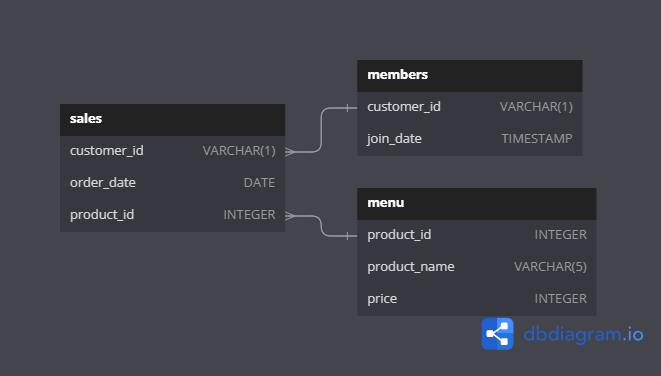

# Case Study #1 - Danny's Diner

This repository contains solutions for the [8 Week SQL Challenge Case Study #1 - Danny's Diner](https://8weeksqlchallenge.com/case-study-1/).

Thanks for Google & ChatGPT/Copilot for help in project.

---

## ERD

---

## Challenge Questions & Answers

1. What is the total amount each customer spent at the restaurant?

   | customer_id | Total Amount Spent |
   | ------------- | -------------------- |
   | A           | 76                 |
   | B           | 74                 |
   | C           | 36                 |
2. How many days has each customer visited the restaurant?

   | customer_id | Number of Days Visited |
   | ------------- | ------------------------ |
   | A           | 4                      |
   | B           | 6                      |
   | C           | 2                      |
3. What was the first item from the menu purchased by each customer?

   | customer_id | First Item Purchased | Purchased On |
   | ------------- | ---------------------- | -------------- |
   | A           | sushi                | 1/1/2021     |
   | B           | curry                | 1/1/2021     |
   | C           | ramen                | 1/1/2021     |
4. What is the most purchased item on the menu and how many times was it purchased by all customers?

   | product_name | Number of Times Purchased |
   | -------------- | --------------------------- |
   | ramen        | 8                         |
5. Which item was the most popular for each customer?

   | customer_id | product_name | purchase_count |
   | ------------- | -------------- | ---------------- |
   | A           | ramen        | 3              |
   | B           | curry        | 2              |
   | B           | sushi        | 2              |
   | B           | ramen        | 2              |
   | C           | ramen        | 3              |
6. Which item was purchased first by the customer after they became a member?

   | customer_id | first_purchase after membership |
   | ------------- | --------------------------------- |
   | A           | ramen                           |
   | B           | sushi                           |
7. Which item was purchased just before the customer became a member?

   | customer_id | LastPurchase | purchase_before_membership |
   | ------------- | -------------- | ---------------------------- |
   | A           | 1/1/2021     | sushi                      |
   | A           | 1/1/2021     | curry                      |
   | B           | 1/4/2021     | sushi                      |
8. What is the total items and amount spent for each member before they became a member?

   | customer_id | Total Items | Total Amount Spent |
   | ------------- | ------------- | -------------------- |
   | A           | 2           | 25                 |
   | B           | 3           | 40                 |
9. If each $1 spent equates to 10 points and sushi has a 2x points multiplier - how many points would each customer have?
10.  | customer_id | Total Points |
    | ------------- | -------------- |
    | A           | 860          |
    | B           | 940          |
    | C           | 360          |
11. In the first week after a customer joins the program (including their join date) they earn 2x points on all items, not just sushi - how many points do customer A and B have at the end of January?

    | customer_id | Total Points |
    | ------------- | -------------- |
    | A           | 1370         |
    | B           | 820          |

Bonus Question 1 - Join All The Things

| customer_id | order_date | product_name | price | MEMBER |
| ------------- | ------------ | -------------- | ------- | -------- |
| A           | 1/1/2021   | sushi        | 10    | N      |
| A           | 1/1/2021   | curry        | 15    | N      |
| A           | 1/7/2021   | curry        | 15    | Y      |
| A           | 1/10/2021  | ramen        | 12    | Y      |
| A           | 1/11/2021  | ramen        | 12    | Y      |
| A           | 1/11/2021  | ramen        | 12    | Y      |
| B           | 1/1/2021   | curry        | 15    | N      |
| B           | 1/2/2021   | curry        | 15    | N      |
| B           | 1/4/2021   | sushi        | 10    | N      |
| B           | 1/11/2021  | sushi        | 10    | Y      |
| B           | 1/16/2021  | ramen        | 12    | Y      |
| B           | 2/1/2021   | ramen        | 12    | Y      |
| C           | 1/1/2021   | ramen        | 12    | N      |
| C           | 1/1/2021   | ramen        | 12    | N      |
| C           | 1/7/2021   | ramen        | 12    | N      |

Bonus Question 2 - Rank All The Things

| customer_id | order_date | product_name | price | member | ranking |
| ------------- | ------------ | -------------- | ------- | -------- | --------- |
| A           | 1/1/2021   | curry        | 15    | N      | null    |
| A           | 1/1/2021   | sushi        | 10    | N      | null    |
| A           | 1/7/2021   | curry        | 15    | Y      | 1       |
| A           | 1/10/2021  | ramen        | 12    | Y      | 2       |
| A           | 1/11/2021  | ramen        | 12    | Y      | 3       |
| A           | 1/11/2021  | ramen        | 12    | Y      | 4       |
| B           | 1/1/2021   | curry        | 15    | N      | null    |
| B           | 1/2/2021   | curry        | 15    | N      | null    |
| B           | 1/4/2021   | sushi        | 10    | N      | null    |
| B           | 1/11/2021  | sushi        | 10    | Y      | 1       |
| B           | 1/16/2021  | ramen        | 12    | Y      | 2       |
| B           | 2/1/2021   | ramen        | 12    | Y      | 3       |
| C           | 1/1/2021   | ramen        | 12    | N      | null    |
| C           | 1/1/2021   | ramen        | 12    | N      | null    |
| C           | 1/7/2021   | ramen        | 12    | N      | null    |
